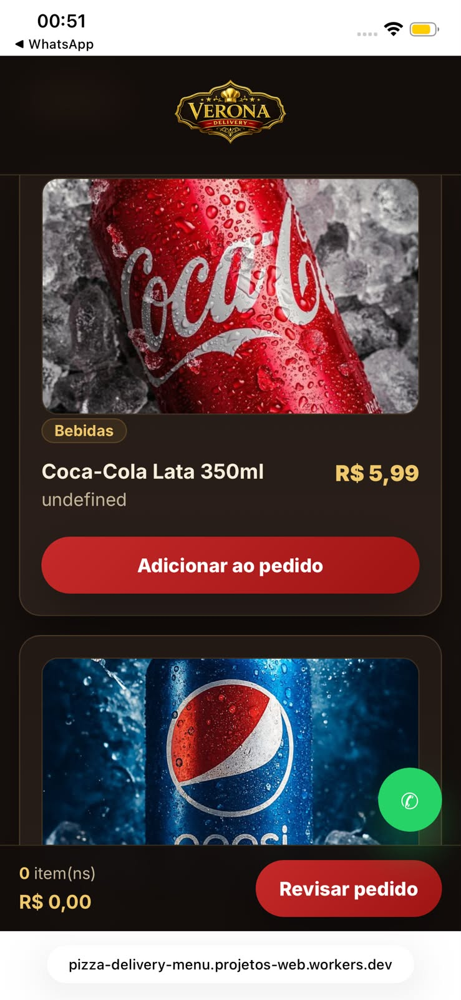
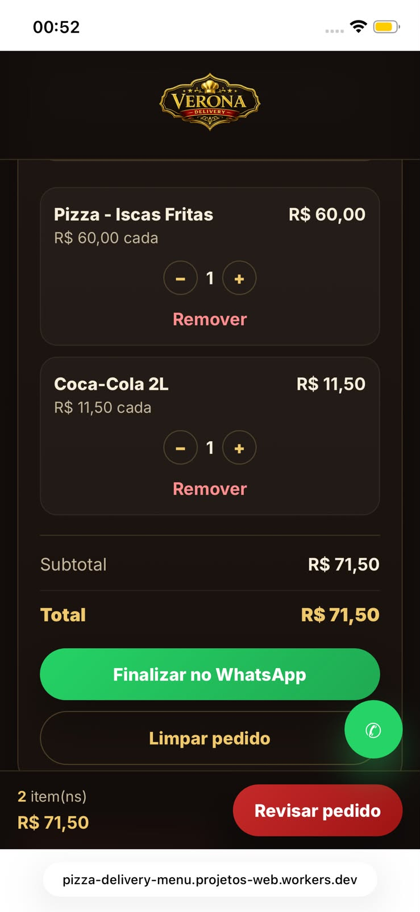

# Verona Delivery

A mobile-first online menu and ordering interface with WhatsApp checkout integration,
showcasing pizzas, esfihas, and drinks with a responsive and visually polished design.

---

## Live Demo

[View Online](https://pizza-delivery-menu.projetos-web.workers.dev)

---

## Screenshots

### Hero Section


<h3>Mobile Experience</h3>



<h3>Menu Experience</h3>



---

## Overview

**Verona Delivery** is a front-end project built to simulate a complete food delivery experience.

The goal was to go beyond a generic showcase page and build a practical digital ordering
flow — combining product presentation, cart management, and WhatsApp checkout integration
into a mobile-first, business-oriented solution.
---

## Features

- Responsive layout optimized for desktop, tablet, and mobile
- Premium hero section with branded promotional banner
- Product categories for:
  - Savory Pizzas
  - Sweet Pizzas
  - Savory Esfihas
  - Sweet Esfihas
  - Savory Pastries
  - Sweet Pastries
- Product cards with image, title, description, and pricing
- Category filters for faster menu exploration
- Cart system with quantity controls
- Persistent cart state using `localStorage`
- Customer order form with essential order details
- Delivery or pickup option selection
- Payment method selection
- WhatsApp checkout flow
- Editable store information and business configuration
- Mobile-focused ordering experience for real customer usage

---

## Business-Oriented Highlights

This project was built with a real use case in mind, which required more than a visually appealing interface.

Key business considerations included:

- reducing friction in the ordering process
- improving product visibility through custom visuals
- making the menu easier to explore on mobile devices
- keeping the order flow simple for non-technical users
- ensuring the business owner could update content with minimal complexity

---

## Tech Stack

- **HTML5**
- **CSS3**
- **JavaScript**
- **LocalStorage**
- **WhatsApp Integration**
- **Git & GitHub**
- **Cloudflare**

---

## Technical Focus

From a development perspective, this project involved:

- building a responsive UI from scratch
- structuring reusable product data for multiple categories
- handling dynamic DOM rendering
- managing cart state and quantity updates
- persisting cart data with `localStorage`
- supporting real-world content customization
- deploying and maintaining a live production version through Cloudflare

---

## Design and UX Priorities

The interface was shaped around a few core priorities:

- **Mobile-first usability**  
  Most users are expected to place orders from mobile devices, so responsiveness and readability were essential.

- **Clear product presentation**  
  Product imagery, spacing, hierarchy, and category filtering were designed to improve browsing and purchase intent.

- **Fast interaction flow**  
  The user can quickly move from discovering products to completing the order without unnecessary steps.

- **Consistent visual identity**  
  The website uses a premium, warm-toned visual direction aligned with the brand’s food positioning.

---

## Project Structure

```bash
├── index.html
├── style.css
├── script.js
├── img/
│   ├── logo.png
│   ├── favicon.png
│   ├── bannerhero.png
│   ├── pizzas/
│   ├── esfihas/
│   └── pasteis/
├── assets/
│   └── readme/
│       ├── hero-preview.png
│       ├── menu-preview.png
│       ├── mobile-preview.png
│       ├── desktop-home.png
│       ├── product-cards.png
│       ├── cart-order.png
│       └── mobile-layout.png
└── README.md

``` 
---

## 👨‍💻 Author

Gabriel Pereira Schwanke

Frontend Developer | Systems Analysis and Development Student