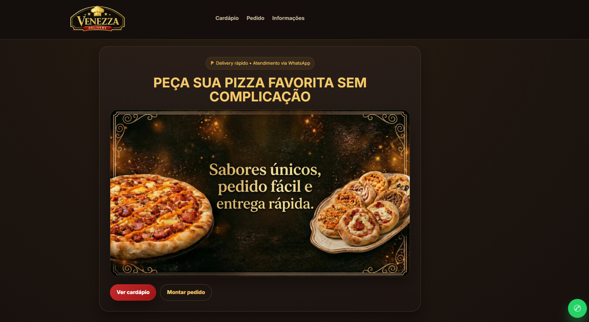
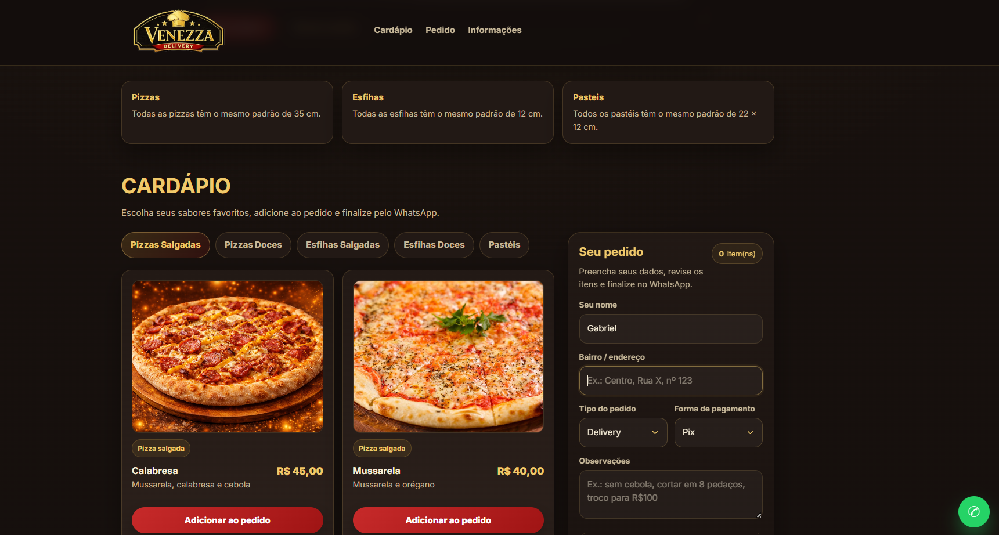
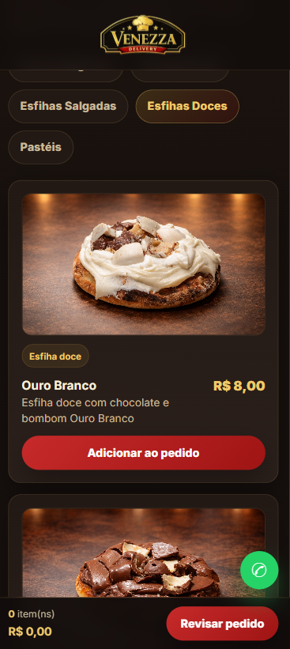

# Venezza Delivery

A production-oriented online menu and ordering interface built for a real local delivery business.  
This project was designed to improve the customer ordering experience through a responsive, visually polished, and mobile-first website that showcases pizzas, esfihas, and pastries while streamlining orders through WhatsApp.

---

## Live Demo

[View Online](https://pizza-delivery-menu.venezzadelivery.workers.dev)

---

## Project Preview

### Hero Section


### Menu Experience


### Mobile Experience



---

## Overview

**Venezza Delivery** is a real-world front-end project developed for a local food delivery business.  
Instead of building a generic showcase page, the goal was to create a practical digital ordering experience focused on usability, product presentation, and business value.

The website allows customers to browse a structured menu, explore product categories, view product images, add items to a cart, fill in order details, and complete the checkout flow through WhatsApp.

This project reflects the kind of front-end work that goes beyond visual layout — combining branding, user experience, mobile responsiveness, state handling, and production deployment into a business-focused solution.

---

## Why This Project Matters

This is not a fictional landing page or a UI exercise.

It was built to support a **real local business**, with real products, real customer flows, and real operational needs.  
That meant every design and development decision had to balance:

- visual quality
- mobile usability
- easy menu navigation
- simple ordering flow
- content flexibility
- practical deployment for day-to-day use

---

## Core Features

- Responsive layout optimized for desktop, tablet, and mobile
- Premium hero section with branded promotional banner
- Product categories for:
  - Savory Pizzas
  - Sweet Pizzas
  - Savory Esfihas
  - Sweet Esfihas
  - Savory Pastries
  - Sweet Pastries
- Product cards with image, title, description, and pricing
- Category filters for faster menu exploration
- Cart system with quantity controls
- Persistent cart state using `localStorage`
- Customer order form with essential order details
- Delivery or pickup option selection
- Payment method selection
- WhatsApp checkout flow
- Editable store information and business configuration
- Mobile-focused ordering experience for real customer usage

---

## Business-Oriented Highlights

This project was built with a real use case in mind, which required more than a visually appealing interface.

Key business considerations included:

- reducing friction in the ordering process
- improving product visibility through custom visuals
- making the menu easier to explore on mobile devices
- keeping the order flow simple for non-technical users
- ensuring the business owner could update content with minimal complexity

---

## Tech Stack

- **HTML5**
- **CSS3**
- **JavaScript**
- **LocalStorage**
- **WhatsApp Integration**
- **Git & GitHub**
- **Cloudflare**

---

## Technical Focus

From a development perspective, this project involved:

- building a responsive UI from scratch
- structuring reusable product data for multiple categories
- handling dynamic DOM rendering
- managing cart state and quantity updates
- persisting cart data with `localStorage`
- supporting real-world content customization
- deploying and maintaining a live production version through Cloudflare

---

## Design and UX Priorities

The interface was shaped around a few core priorities:

- **Mobile-first usability**  
  Most users are expected to place orders from mobile devices, so responsiveness and readability were essential.

- **Clear product presentation**  
  Product imagery, spacing, hierarchy, and category filtering were designed to improve browsing and purchase intent.

- **Fast interaction flow**  
  The user can quickly move from discovering products to completing the order without unnecessary steps.

- **Consistent visual identity**  
  The website uses a premium, warm-toned visual direction aligned with the brand’s food positioning.

---

## Project Structure

```bash
├── index.html
├── style.css
├── script.js
├── img/
│   ├── logo.png
│   ├── favicon.png
│   ├── bannerhero.png
│   ├── pizzas/
│   ├── esfihas/
│   └── pasteis/
├── assets/
│   └── readme/
│       ├── hero-preview.png
│       ├── menu-preview.png
│       ├── mobile-preview.png
│       ├── desktop-home.png
│       ├── product-cards.png
│       ├── cart-order.png
│       └── mobile-layout.png
└── README.md
